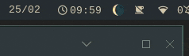

# Waybar-Luna Module
A module for your waybar setup that displays the current moonphase, with an added on-click animation.


Tooltip provides more info:



on-click animation:


How it animates:

## Notes
- This bash script is entierly local, it doesn't call out to any other source of knowledge to request information
- There are two options for how you choose to divide up the length of each lunar phase
    - Option 1: (default) the phases are divided up mostly evenly, based on those that Omni Calc uses https://www.omnicalculator.com/everyday-life/moon-phase
        - This option animates nice and smoothly
    - Option 2: the significant quarters (1st, Ful, 3rd, New) are each only a single day, giving you more a distinct idea of when they are
        - This option's animattion is a little more jumpy but to the 'sudden' jumps on the significant quarters
    - It turns out the spacing on these two options aren't actually all that different, which I didnt realise that until I started writing this README
- Because this is written as a bash script, not C++, the styling is limited
    - It doesn't have any of the C++ styling classes which you would usually use to do fancy styling things
    - Instead, it falls back on waybar's defaults for interpreting the JSON output, using `alt` to define the icon and `tooltip` to define the tooltip
    - If you want to add fancier styling, I believe you would need to convert this to C++
- Feel free to change which emoji's are used for the icons, there are some single colour alternatives in the [nerdfonts cheat sheet](https://www.nerdfonts.com/cheat-sheet) if you search "moon"
    - the code currently only supports 9 phases (as shown below), because that is all the emoji library has. If you choose to use the nerd fonts icons, you will get more phases. You could add more phases to this module by adding more `IF....ELIF` statements to `luna.sh` and increasing the number of icons the in `format-icons` array in `config.jsonc` 

## Implementation
### Clone this repo
You can store `luna.sh` wherever you want, as long as the location is *writable* (luna needs to be able to create temporary files for keeping track of what it is currently displaying):
```
git clone https://github.com/KieranReck/waybar-luna.git
```
Make `luna.sh` executable
```
chmod +x <file-path>/luna.sh
```

### Add luna to your waybar `config.jsonc` file:

Add the module to one of the `"modules-left"`, `"modules-center"`, or `"modules-right"` arrays:
```
"custom/luna",
```

Then add the actual module code to your waybar config file:

```
"custom/luna": {
    "exec": "<file-path>/luna.sh",
    "on-click": "<file-path>/luna.sh animate && pkill -SIGRTMIN+10 waybar",
    "signal": 10,
    "interval": 20000, /* this catches things like a new day starting*/
    "return-type": "json",
    "format": "{icon}",
    "format-icons": {
        "1": "🌑",
        "2": "🌒",
        "3": "🌓",
        "4": "🌔",
        "5": "🌕",
        "6": "🌖",
        "7": "🌗",
        "8": "🌘",
        "9": "🌑"
    }
```
#### Remember...
- Replace `<file-path>` in `"exec"` and `"on-click"` to match where you stored`luna.sh`. eg, mine reads `"exec": "~/repos/waybar-luna/luna.sh",`
- waybar config is written in json, so each module entry in your list needs to be followed by a comma except for the final item in the list. So if you have added luna to you config file anywhere but the bottom, you will need to add a comma after the final bracket, eg: `},` 
